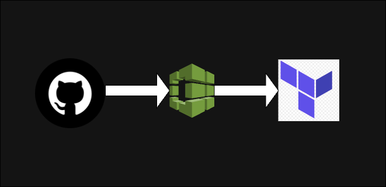

# CI/CD Terraform Project


----

## Project Overview

This project demonstrates the creation of a CI/CD pipeline using AWS CodeBuild to automatically apply Terraform scripts whenever changes are committed to a GitHub repository. The project involves setting up an environment that includes creating an EC2 instance, configuring necessary AWS resources, and automating the deployment process using shell scripts and a buildspec.yml file.

## Prerequisites

- AWS account with appropriate permissions
- GitHub account
- SSH access to your desktop

## Steps

### 1. Cloning the Repository

Created and cloned a public GitHub Repository using SSH to the desktop.

### 2. Creating `ec2.tf` File

The `ec2.tf` file includes the following configurations:
- AWS provider with proper credentials
- Creation of a default VPC if one does not exist
- Storing the Terraform state file in an S3 bucket
- Using data source to get all availability zones in the region
- Creating a default subnet if one does not exist
- Creating a security group for the EC2 instance
- Using the data source to get a registered Amazon Linux 2 AMI
- Launching the EC2 instance, installing a website, and providing the server URL for access

### 3. Creating Shell Scripts

Shell scripts were created to:
- Install Terraform
- Configure a profile
- Run Terraform commands

These scripts were saved in the `cicd` folder for execution.

### 4. Creating `buildspec.yml` File

The `buildspec.yml` file for the CodeBuild job includes the following:

```yaml
version: 0.2

phases:
  install:
    runtime-versions:
      python: 3.x

  pre_build:
    commands:
      - cd cicd # change directory
      - chmod +x install-terraform.sh configure-named-profile.sh apply-terraform.sh # make files executable
      - ./install-terraform.sh # install terraform
      - ./configure-named-profile.sh # configure named profile

  build:
    commands:
      - ./apply-terraform.sh
```

### 5. Storing Terraform State File in S3

A Terraform state file is stored in an S3 bucket by creating an S3 bucket and configuring the `ec2.tf` file to store the file in the bucket.

### 6. Creating Build Project in CodeBuild

- GitHub was chosen as the primary source to pull the code from.
- The event type was modified for PUSH and PULL_REQUESTED_MERGED.
- Four environment variables were added.
- The Buildspec file name was specified.
- CodeBuild clones the repository, runs the `buildspec.yml` file, and executes the Terraform script to create an EC2 instance and install the TechMax website onto it.

### 7. Updating `apply-terraform.sh` File

The `apply-terraform.sh` file was updated to remove the comment on line 16 and make line 13 a comment. The updated script looks like this:

```bash
#!/bin/bash

# fail on any error
set -eu

# go back to the previous directory
cd ..

# initialize terraform
terraform init

# # apply terraform
# terraform apply -auto-approve

# destroy terraform
terraform destroy -auto-approve
```

After updating, the file was pushed to the GitHub repository, triggering a new build in CodeBuild that destroyed the resources.

## File Structure

```
.
├── ec2.tf
├── cicd/
│   ├── install-terraform.sh
│   ├── configure-named-profile.sh
│   ├── apply-terraform.sh
├── buildspec.yml
```

## Conclusion

This project sets up a robust CI/CD pipeline using AWS CodeBuild and Terraform, demonstrating automated infrastructure deployment and management. By following the steps outlined above, you can replicate this setup and modify it to suit your specific requirements.
